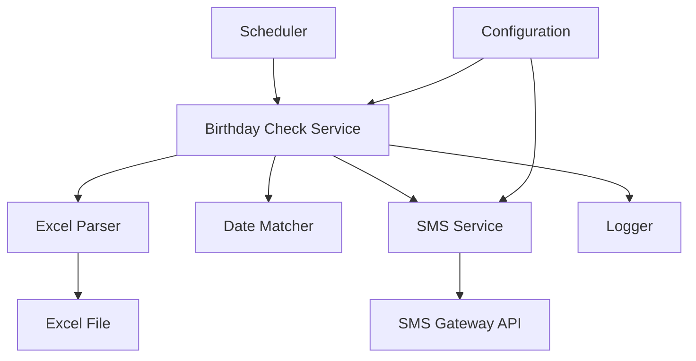

# Design Document

## Overview

The Birthday Notification System is an automated solution that monitors associate birthdays from an Excel spreadsheet and sends daily SMS notifications when birthdays occur. The system consists of three main components: an Excel Parser for reading associate data, a Date Matcher for identifying birthdays, and an SMS Service for sending notifications.

The system operates on a scheduled basis, performing daily checks and sending a consolidated SMS message to a configured recipient number listing all associates with birthdays on that day.

## Architecture

The system follows a modular architecture with clear separation of concerns:



**Component Flow:**
1. Scheduler triggers the Birthday Check Service daily
2. Birthday Check Service loads configuration and initiates the check
3. Excel Parser reads associate data from the Excel file
4. Date Matcher compares current date with associate birth dates
5. SMS Service formats and sends notification if birthdays are found
6. Logger records all operations and results

## Components and Interfaces

### 1. Birthday Check Service (Orchestrator)

**Responsibility:** Coordinates the daily birthday check workflow

**Interface:**
```typescript
interface BirthdayCheckService {
  performDailyCheck(): Promise<CheckResult>;
}

interface CheckResult {
  totalAssociatesChecked: number;
  birthdaysFound: Associate[];
  notificationSent: boolean;
  errors: string[];
}
```

**Behavior:**
- Loads configuration on initialization
- Orchestrates the check workflow
- Handles errors gracefully and logs results

### 2. Excel Parser

**Responsibility:** Reads and extracts associate data from Excel files

**Interface:**
```typescript
interface ExcelParser {
  parseFile(filePath: string): Promise<Associate[]>;
}

interface Associate {
  name: string;
  dateOfBirth: Date;
  rowNumber: number;
}
```

**Behavior:**
- Supports .xlsx and .xls formats
- Validates date of birth format
- Skips invalid rows with logging
- Extracts from first worksheet by default

**Expected Excel Format:**
- Column A: Associate Name
- Column B: Date of Birth (format: MM/DD/YYYY or DD/MM/YYYY)

### 3. Date Matcher

**Responsibility:** Identifies associates with birthdays matching the current date

**Interface:**
```typescript
interface DateMatcher {
  findBirthdaysToday(associates: Associate[]): Associate[];
}
```

**Behavior:**
- Compares month and day only (ignores year)
- Returns all matching associates
- Handles timezone considerations using system local time

### 4. SMS Service

**Responsibility:** Sends SMS notifications via external gateway

**Interface:**
```typescript
interface SMSService {
  sendBirthdayNotification(associates: Associate[]): Promise<SMSResult>;
}

interface SMSResult {
  success: boolean;
  messageId?: string;
  error?: string;
  timestamp: Date;
}
```

**Behavior:**
- Formats message with associate names
- Validates recipient number
- Handles API authentication
- Returns delivery status

**Message Format:**
```
Birthday Alert! Today's birthdays:
- [Associate Name 1]
- [Associate Name 2]
- [Associate Name 3]
```

### 5. Configuration Manager

**Responsibility:** Manages system configuration

**Interface:**
```typescript
interface Configuration {
  excelFilePath: string;
  recipientMobileNumber: string;
  smsProvider: {
    apiUrl: string;
    apiKey: string;
    senderId: string;
  };
  scheduledTime: string; // HH:MM format
}
```

**Configuration Sources:**
- Environment variables (preferred for credentials)
- Configuration file (config.json or .env)

### 6. Scheduler

**Responsibility:** Triggers daily birthday checks

**Options:**
- Cron job (Linux/Mac)
- Task Scheduler (Windows)
- Node.js scheduling library (node-cron)

**Configuration:** Runs at specified time daily (e.g., 9:00 AM)

## Data Models

### Associate Model

```typescript
class Associate {
  name: string;
  dateOfBirth: Date;
  rowNumber: number;
  
  constructor(name: string, dateOfBirth: Date, rowNumber: number) {
    this.name = name;
    this.dateOfBirth = dateOfBirth;
    this.rowNumber = rowNumber;
  }
  
  isBirthdayToday(): boolean {
    const today = new Date();
    return this.dateOfBirth.getMonth() === today.getMonth() &&
           this.dateOfBirth.getDate() === today.getDate();
  }
}
```

### Configuration Model

```typescript
class SystemConfiguration {
  excelFilePath: string;
  recipientMobileNumber: string;
  smsApiUrl: string;
  smsApiKey: string;
  smsSenderId: string;
  scheduledTime: string;
  
  validate(): ValidationResult {
    // Validates all required fields are present
    // Validates mobile number format
    // Validates file path exists
  }
}
```

## Error Handling

### Error Categories

1. **Configuration Errors**
   - Missing or invalid configuration values
   - Invalid mobile number format
   - Missing API credentials
   - Action: Log error and halt execution

2. **File Errors**
   - Excel file not found
   - Invalid file format
   - Corrupted file
   - Action: Log error and halt execution

3. **Data Validation Errors**
   - Invalid date format in Excel
   - Missing required fields
   - Action: Skip row, log warning, continue processing

4. **SMS Delivery Errors**
   - API authentication failure
   - Network timeout
   - Invalid recipient number
   - Action: Log error with details, mark notification as failed

5. **Scheduling Errors**
   - Scheduler fails to trigger
   - Action: Depends on scheduler implementation (retry, alert)

### Error Logging

All errors should be logged with:
- Timestamp
- Error category
- Error message
- Context (e.g., row number, associate name)
- Stack trace (for unexpected errors)

### Retry Strategy

- SMS delivery failures: Retry up to 3 times with exponential backoff
- File read errors: No retry (requires manual intervention)
- API authentication errors: No retry (requires configuration fix)

## Testing Strategy

### Unit Tests

1. **Excel Parser Tests**
   - Valid Excel file parsing
   - Invalid file format handling
   - Missing date of birth handling
   - Different date formats
   - Empty file handling

2. **Date Matcher Tests**
   - Birthday match detection
   - Non-birthday filtering
   - Leap year birthday handling
   - Timezone edge cases

3. **SMS Service Tests**
   - Message formatting with single associate
   - Message formatting with multiple associates
   - API call with valid credentials
   - API call with invalid credentials
   - Network error handling

4. **Configuration Tests**
   - Valid configuration loading
   - Missing required fields
   - Invalid mobile number format
   - Environment variable precedence

### Integration Tests

1. **End-to-End Birthday Check**
   - Load test Excel file with known birthdays
   - Mock current date to match test birthdays
   - Verify SMS service receives correct associate list
   - Verify logging output

2. **No Birthday Scenario**
   - Load test Excel file with no matching birthdays
   - Verify no SMS is sent
   - Verify appropriate logging

3. **Error Scenarios**
   - Missing Excel file
   - Invalid Excel format
   - SMS API failure
   - Invalid configuration

### Test Data

Create test Excel files with:
- Associates with today's birthday
- Associates with past birthdays
- Associates with future birthdays
- Invalid date formats
- Missing data

## Security Considerations

1. **Credential Management**
   - Store API keys in environment variables
   - Never commit credentials to version control
   - Use .env files with .gitignore

2. **Data Privacy**
   - Do not log full mobile numbers (mask digits)
   - Do not log API keys
   - Secure Excel file access permissions

3. **Input Validation**
   - Validate all configuration inputs
   - Sanitize data from Excel file
   - Validate mobile number format

## Deployment Considerations

1. **Environment Setup**
   - Node.js runtime (v14 or higher recommended)
   - Required npm packages: xlsx, node-cron, axios (or similar)
   - Configuration file or environment variables

2. **Scheduler Setup**
   - Configure cron job or Task Scheduler
   - Ensure system runs at specified time daily
   - Set up monitoring/alerting for failures

3. **File Access**
   - Ensure Excel file path is accessible
   - Consider file locking if Excel is updated during check
   - Handle file permission issues

4. **Logging**
   - Configure log file location
   - Implement log rotation
   - Set appropriate log levels (INFO, WARN, ERROR)

## Future Enhancements

1. Support for multiple notification recipients
2. Customizable message templates
3. Web dashboard for viewing birthday history
4. Email notifications in addition to SMS
5. Support for multiple Excel files
6. Birthday reminders (e.g., 1 day before)
7. Associate profile pictures in notifications
